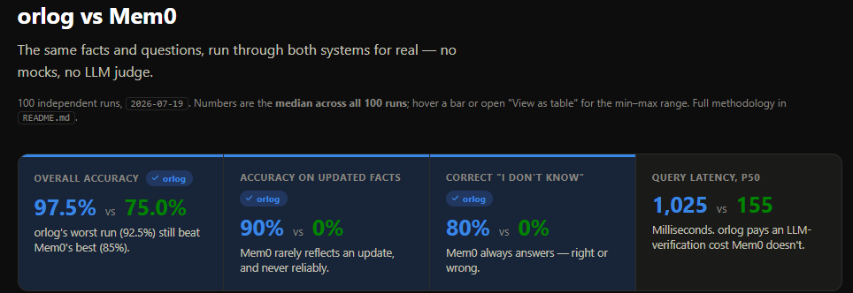

# orlog

[](https://github.com/mrrasmussendk/Orlog/actions/workflows/ci.yml)
[](LICENSE)
[](pyproject.toml)

> Odin feared for Huginn, but worried more for Muninn.
> — *Grímnismál*

**orlog is memory for AI agents that would rather say "I don't know" than be
wrong.** Every claim it hands back is either **VERIFIED** — checked against
the raw historical record, on every single call, no exceptions — or
**ABSTAINED**, with a reason. Nothing in between. No confident-sounding
guesses.

The name is the Norse *ørlǫg*: the immutable layers of what has been laid
down, from which the Norns weave the present. That is the architecture — an
append-only, hash-chained event log, with interpretation continuously
re-woven on top of it, and a deterministic gatekeeper checking every claim
before it reaches the world. Agent knowledge moves through an explicit state
machine instead of an opaque "memory store," so a system built on orlog can
always say *why* it believes something.

> **New here?** [`docs/WHAT-IS-ORLOG.md`](docs/WHAT-IS-ORLOG.md) explains the
> whole idea from scratch, with no jargon and no Norse mythology required.
> Then come back to [Install](#install) and [Your first 60 seconds](#your-first-60-seconds).

## Is orlog for you?

**Use it if** you are building an agent where a wrong remembered fact is
expensive — support, billing, compliance, health, anything with an audit
trail — and you would rather the agent abstain than improvise. You want to
ask *"what did we believe about this on June 1st, and why?"* and get a real
answer with citations.

**Don't use it if** you want a fast, fuzzy semantic scratchpad for chat
context. orlog deliberately spends time verifying every answer (~1s p50 vs.
~155ms for Mem0 — see [the benchmark](#benchmarked-against-mem0)), and it
only stores structured facts, not free-form text blobs.

## Install

Python 3.10+ required.

```bash
git clone https://github.com/mrrasmussendk/Orlog.git
cd Orlog
python -m pip install -e ".[anthropic,openai]"
```

The `anthropic` / `openai` extras are only needed for the real LLM
extractor. Plain `pip install -e .` is enough to run everything
deterministically, no API key involved.

Prefer no Python at all? Every tagged release ships a standalone binary —
see [Standalone binary](#standalone-binary-no-python-required).

## Your first 60 seconds

Two things to know before the code: orlog stores **structured facts**
shaped `entity` / `attribute` / `value`, and it needs a **vault key** (it
encrypts the PII it tokenizes out of your text).

```python
import os
from orlog.config import OrlogConfig, WorkspaceConfig
from orlog.runtime import Runtime
from orlog.server_tools import remember_tool, recall_tool
from orlog.vault import generate_key
from orlog.workspace import Workspace

os.environ["ORLOG_VAULT_KEY"] = generate_key()   # keep this; you need it to reopen the workspace

runtime = Runtime(
    Workspace("./myproject"),
    OrlogConfig(workspace=WorkspaceConfig(name="myproject")),
)

remember_tool(runtime, "Alice's plan is Pro",
              entity="user:alice", attribute="plan", value="Pro")

recall_tool(runtime, "user:alice.plan")
recall_tool(runtime, "user:alice.shoe_size")
```

The two `recall_tool` calls return, respectively:

```python
{
  "verified": True,
  "claim": "user:alice.plan = Pro",
  "citations": [{"event_id": "01M1SBE...SCE", "excerpt": "Pro",
                 "valid_from": "2026-09-05T17:56:33.922061Z", "valid_to": None,
                 "recorded_at": "2026-09-05T17:56:33.923818Z"}],
  "as_of": "2026-09-05T17:56:33.924467Z",
  "route": "fresh",
  "truth_version": "windows@01M1SBE...SCE",
  "abstained": False,
  "reasons": [],
}

{
  "verified": False,
  "claim": None,
  "citations": [],
  "abstained": True,
  "reasons": ["NO_CANDIDATES"],
}
```

Nothing gets asserted that can't be traced back to a specific, timestamped
event. Ask about something orlog never learned, and it tells you so instead
of inventing an answer.

> `ORLOG_VAULT_KEY` is not stored on disk. Lose it and the encrypted
> pseudonym registry for that workspace is unrecoverable.

## Use it from Claude Code

orlog speaks MCP, so an agent can call `remember` / `recall` directly.
One command wires it up:

```bash
orlog init myproject --claude-code   # scaffolds the workspace AND registers the
                                     # MCP server (with its vault key) in ~/.claude.json
```

Restart Claude Code and the `remember`, `recall`, `recall_history`,
`check_action`, and `stats` tools are available. To do it by hand instead:

```bash
orlog init myproject          # prints a vault key
export ORLOG_VAULT_KEY=...    # from the line above
cd myproject && orlog serve   # MCP stdio server
```

## The five things to know

1. **Facts are `entity.attribute = value`.** `remember` requires all three
   together — a text-only memory is rejected, because it would not be
   retrievable. The free text you pass alongside them is kept as the
   citation excerpt.
2. **Every answer is VERIFIED or ABSTAINED.** There is no third outcome, and
   an abstention always carries machine-readable `reasons`.
3. **There are two independent clocks.** `as_of` is *valid* time — the
   instant you are asking about. `known_as_of` is *transaction* time — the
   instant the answer is allowed to know about, so you can reconstruct what
   the system believed before a correction landed.
4. **Nothing is ever deleted or edited.** A change is a new event that
   supersedes the old one; the old one stays in the log forever. `orlog
   forget` is the one exception, and even it doesn't rewrite history: it
   deletes the encrypted pseudonym mapping so the PII tokens left in the log
   can never be resolved back to a real value (crypto-shredding), and
   records the erasure as another event.
5. **The Norse names are just layers.** `urd` = the log, `verdandi` = the
   current projection, `huginn` = extraction, `heimdall` = the verifier,
   `muninn` = the cache, `skuld` = the outcome ledger. Full map
   [below](#the-norse-module-map).

## Benchmarked against Mem0



Same facts, same questions, both systems for real — no mocks, no LLM judge,
100 independent runs. orlog wins accuracy (97.5% vs. 75%) and correct
abstention (80% vs. 0%) decisively, and its worst single run still beat
Mem0's best; Mem0 answers faster per query (155ms vs. 1,025ms p50) because
it skips the citation-verification step orlog never skips. Full
methodology, charts, and the real retrieval bug this benchmark found and
fixed: [`benchmarks/vs_mem0/README.md`](benchmarks/vs_mem0/README.md).

## The state machine

```
OBSERVED ──► INTERPRETED ──► RETRIEVED ──► ASSERTED ──► VERIFIED ──► REINFORCED
(logged)     (projected)     (as-of)       (derived,     (sovereign     (outcome
                                            must cite)     check)         weights)
                                                 │             │
                                                 │             └─ fail ─► RE-DERIVE ─► ABSTAINED
                                                 │                            │
                                                 │                     (retry once,
                                                 │                      then give up)
                                                 └──────────────────────────────────────
                                                    every claim ends VERIFIED or ABSTAINED
```

Every claim a consuming agent can act on is either **VERIFIED** (it passed a
deterministic check, against something outside the memory's own opinion of
itself) or **ABSTAINED** (verification failed twice — once on the original
derivation, once after a single re-derivation attempt — so the system says "I
can't verify this" instead of guessing).

[`docs/DESIGN-PRINCIPLES.md`](docs/DESIGN-PRINCIPLES.md) is the design
rationale (the twelve principles this architecture is built to satisfy).
[`docs/ORLOG-SPEC.md`](docs/ORLOG-SPEC.md) is the normative protocol (v1.0) —
Part A (protocol core) and Part B (the production runtime: MCP server, SQLite
storage, a real LLM `Deriver`, security/PII vault, CLI) are both built and
tested. See "Known deviations" below for the handful of places the code
doesn't match the spec exactly.

## The Norse module map

Fourteen modules, six layers, one rule: nothing reaches the world without
evidence.

<details>
<summary><strong>Full module-by-module breakdown</strong> (click to expand)</summary>

| Module                | Norse role                              | Layer | What it does |
|------------------------|-----------------------------------------|-------|---------------|
| `urd.py`               | the fixed past — the event log           | L0    | append-only, hash-chained JSONL, ULID ids |
| `storage.py`           | —                                        | L0    | segment rotation (64MB) + the SQLite index, both derivable from the log |
| `verdandi.py`          | what-is-becoming — the projection layer  | L1    | `supersession_chains`: validity windows per fact |
| `verdandi_sessions.py` | —                                        | L1    | `session_summaries`: deterministic per-session digest |
| `retrieval.py`         | —                                        | L2    | point lookup: `retrieve_current_fact` |
| `retrieval_hybrid.py`  | —                                        | L2    | free-text search: lexical + cosine, pluggable `Embedder` |
| `huginn.py`            | thought, sent out for answers — derivation | L3  | `Deriver` protocol, `ScriptedDeriver` (no LLM, deterministic) |
| `huginn_llm.py`        | —                                        | L3    | `LLMDeriver`: real anthropic/openai calls, prompt contract, JSON repair |
| `heimdall.py`          | the watchman at the gate — the verifier  | L4    | checks V1–V4, own ground-truth table (the "windows" backend) |
| `heimdall_pytest.py`   | —                                        | L4    | the "pytest" backend: ground truth = the test suite |
| `verifiers.py`         | —                                        | L4    | the "module:" dynamic-loader extension point |
| `skuld.py`             | what is owed — the outcome ledger        | L5    | records outcomes + importance weighting/decay |
| `muninn.py`            | memory — the route cache Heimdall never trusts on return | cross-cutting | LRU-bounded, gated on re-verification |
| `pipeline.py`          | —                                        | —     | `answer()`: wires cache → verify → retrieve → derive → verify → retry → abstain |
| `states.py`            | the epistemic state machine itself       | —     | legal transitions |
| `vault.py` / `scrub.py`| —                                        | —     | PII tokenization, AES-GCM-encrypted pseudonym registry |
| `config.py`            | —                                        | —     | `orlog.toml` |
| `workspace.py`         | —                                        | —     | directory layout + single-writer lock |
| `runtime.py`           | —                                        | —     | wires a Workspace + Config into a live Pipeline |
| `cli.py`               | —                                        | —     | `orlog init/serve/conformance/replay/inspect/forget` |
| `server.py` / `server_tools.py` | —                               | —     | the MCP server: `remember`/`recall`/`recall_history`/`check_action`/`stats` |
| `observability.py`     | —                                        | —     | structured JSON logs + stats counters |
| `errors.py`            | —                                        | —     | the closed error taxonomy (E_SCHEMA, E_LOCKED, ...) |

The reference domain throughout is point-in-time facts shaped
`{"entity", "attribute", "value"}`. `ScriptedDeriver` is extractive
(deterministic, no LLM call) and ships permanently, per spec, for
API-key-free conformance runs; `LLMDeriver` is the real thing, swapped in via
`orlog.toml`'s `[deriver] backend = "anthropic" | "openai" | "scripted"`.

</details>

## Layout

```
docs/WHAT-IS-ORLOG.md       the no-jargon introduction — start here
docs/DESIGN-PRINCIPLES.md   design rationale
docs/ORLOG-SPEC.md          normative protocol v1.0 — source of truth for src/orlog/
spec/schemas/                JSON Schema contracts for the six layers
src/orlog/models/            pydantic models mirroring the schemas
src/orlog/                   see the module map above
tests/                       one test per contract, plus a unit-test file per module
tests/conformance/           C1 supersession, C2 cache staleness, C3 imperfect projection, C4 citation discipline, C5 immutability & replay
```

## CLI reference

```
orlog init myworkspace          # scaffold a workspace, prints a vault key to export
orlog init myworkspace --claude-code   # ...and register it as an MCP server in Claude Code
orlog serve                     # MCP stdio server
orlog replay                    # verify the hash chain, rebuild index.sqlite
orlog inspect <event_id>        # provenance chain
orlog forget <PSEUDONYM_TOKEN>  # crypto-shred
orlog conformance               # run tests/conformance/ against this install
```

Every command except `conformance` takes an optional workspace path
(default: the current directory), given last — `orlog inspect <event_id>
./myworkspace`. The commands that open the vault (`serve`, `forget`) need
`ORLOG_VAULT_KEY` in the environment; `init` is what generates it.

## Standalone binary (no Python required)

Every tagged release (`vX.Y.Z`) publishes standalone `orlog` executables
for Windows, macOS, and Linux to
[GitHub Releases](https://github.com/mrrasmussendk/Orlog/releases) — no
Python install required. Download the zip for your platform, unzip it
somewhere on `PATH`, and the same CLI/MCP-server workflow above applies
unchanged:

```
orlog init myworkspace --claude-code
```

The binary bundles both the `anthropic` and `openai` extras. The default
`fastembed` embedder still downloads its model over the network on first
use (see `orlog.toml`'s `[retrieval] embedder`); everything else works
fully offline.

## Development

```bash
python -m pip install -e ".[dev,anthropic,openai]"
pytest
```

Tests marked `integration` make real Anthropic API calls and are skipped by
default; run them with `pytest -m integration` and an `ANTHROPIC_API_KEY`
set.

## Known deviations from ORLOG-SPEC.md v1.0

- `pipeline.py` is 426 lines, well over this project's own ~200-line-per-file
  guideline — it's the central orchestrator wiring every layer together
  plus the optional stats hooks, and splitting it felt riskier than leaving
  it, but it's a candidate for a future cleanup pass.
- `FastEmbedEmbedder` (the spec-default embedder, `BAAI/bge-small-en-v1.5`)
  is now exercised directly by `tests/test_retrieval_hybrid.py`'s
  `resolve_key()` regression tests (three cases, added alongside the
  retrieval-bug fix documented in `benchmarks/vs_mem0/README.md`) — no
  skip marker, and they pass under a plain `pytest` invocation. What's
  still true: no test builds a full `Runtime` with the default embedder
  and uses it live end-to-end. Every test that builds a `Runtime` still
  pins `config.retrieval.embedder = "hashing"` explicitly (or, in
  `test_runtime.py`'s timeout test, monkeypatches the build to hang and
  never actually constructs one) rather than relying on `OrlogConfig`'s
  default, since a cold fastembed build is network-bound.
  `min_confidence`/`ambiguity_margin` for those tests are relaxed back to
  the values calibrated for `HashingEmbedder` (see `RetrievalConfig`'s
  docstring).
- The workspace lock (`workspace.py`) writes its own pid and checks
  whether a held lock's recorded pid is still alive (`_pid_alive()`,
  cross-platform) before honoring it — a stale lock from a crashed or
  killed process is reclaimed automatically rather than blocking forever.
  It is still not a real OS-level advisory lock (no flock/fcntl) and not a
  distributed primitive — enough to stop a second `orlog serve` on the
  same machine, not across machines.
- `orlog conformance --target self` only supports `self` (shells out to this
  install's own `tests/conformance/`); a remote `--target=<endpoint>` mode
  isn't built, since spec's MCP transport is stdio-only in v1.0.
