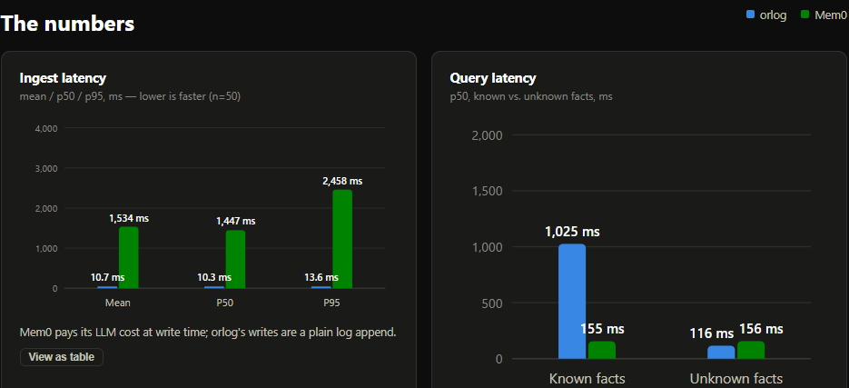
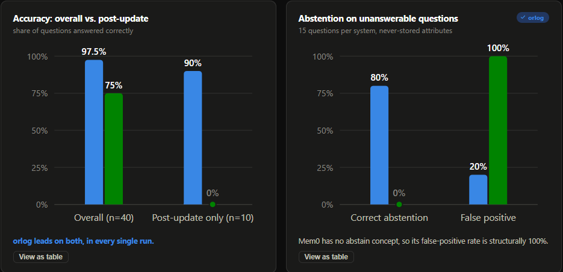

# orlog vs Mem0 benchmark

Compares [orlog](../../README.md) and [Mem0](https://github.com/mem0ai/mem0)
on speed, accuracy, and abstention/false-positive behavior, using a
deterministic 10-entity/4-attribute synthetic dataset (`dataset.py`).

**Bottom line, across 100 real runs:** orlog wins accuracy (97.5% vs. 75%)
and correct abstention (80% vs. 0%) decisively -- and its worst single run
still beat Mem0's best. Mem0 wins raw query speed (155ms vs. 1,025ms p50),
since orlog pays a real LLM-verification cost Mem0 doesn't.

Full design rationale:
[`docs/superpowers/specs/2026-07-17-vs-mem0-benchmark-design.md`](../../docs/superpowers/specs/2026-07-17-vs-mem0-benchmark-design.md).

**Contents:** [Results](#results-100-runs-2026-07-19) ·
[Running it](#running-it) · [Run-to-run variance](#run-to-run-variance) ·
[Retrieval bug found and fixed](#retrieval-bug-found-and-fixed) ·
[Methodology](#methodology)

## Results (100 runs, 2026-07-19)






Live, interactive version (hover a bar or click "View as table" for the
full min-max range across runs): [`dashboard.html`](dashboard.html).

## Running it

Requires both `ANTHROPIC_API_KEY` and `OPENAI_API_KEY` in the environment
(orlog uses Anthropic's `claude-haiku-4-5` -- its own calibrated default,
see "Model note" below; Mem0 uses OpenAI's `gpt-4o-mini`) and the
`benchmark` extra installed:

```
python -m pip install -e ".[benchmark]"
python -m benchmarks.vs_mem0
```

This makes real, billed API calls: one derivation call per orlog query
(Anthropic), one extraction (+ possible update-decision) call per Mem0
`add()` (OpenAI). At this benchmark's scale (40 initial facts + 10 updates +
55 questions per system) that's on the order of 100-150 LLM calls total,
well under $1 per run.

By default this runs the whole benchmark **3 times** and reports the
median of each metric across runs (see "Run-to-run variance" below for
why). Pass `--runs N` to change that -- `--runs 1` for a single cheap
pass, or a higher N for a tighter estimate:

```
python -m benchmarks.vs_mem0 --runs 1
```

Each run's raw per-item results are written to `runs/orlog_results_run{i}.json`
and `runs/mem0_results_run{i}.json`; the combined, aggregated
`results.json` is what the dashboard reads.

**Model note (two real bugs found and fixed along the way):**

The original design called for both systems on the same OpenAI model
(`gpt-5-mini` first, then `gpt-4o-mini`) for a strict same-model comparison.
Two real, provider-independent problems surfaced from actually running it,
both fixed in `src/orlog/` rather than worked around from the benchmark
side, since they affect orlog generally, not just this benchmark:

1. **`gpt-5-mini` rejects any non-default `temperature`** via the Chat
   Completions API ("Only the default (1) value is supported") and also
   rejects the legacy `max_tokens` parameter. Both orlog's
   `OpenAICompletion` (hardcoded `temperature=0`, by design) and Mem0's
   default extraction (`temperature=0.1` internally) hit this on every
   call. Fixed by switching both runners to `gpt-4o-mini`.

2. **orlog's real-LLM derivation path returned `INSUFFICIENT`/`UNSUPPORTED`
   on nearly every query, on every model tested (5 real models across both
   providers, including orlog's own README example).** Root cause, found
   by isolating the exact prompt orlog sends: `retrieve_current_fact()`
   (`src/orlog/retrieval.py`) only ever gave the deriver a fact's bare
   stored value (e.g. `"Pro"`), with no attribute label or grounding
   sentence -- genuinely insufficient for a careful model to verify against
   a terse `"Question: user:alice.plan"` prompt, regardless of the model's
   capability. Separately, once the deriver *did* produce a claim, heimdall's
   V4 SUPPORTS check (`src/orlog/heimdall.py`) -- which deliberately
   requires the claim to literally contain both the fact's own
   `"{entity}.{attribute}"` key and its value, to catch a claim built from a
   wrong-but-plausible citation -- was rejecting well-formed natural-language
   claims that never restated the literal key. Fixed with two small,
   additive changes: `Candidate` gained an `excerpt` field (spec §3.4
   already anticipated this field; the runtime just never populated it)
   carrying the fact's remembered evidence text, and `huginn_llm.py`'s
   `SYSTEM_PROMPT` now explicitly instructs the model to restate the
   question verbatim in its claim. Verified against real Anthropic and
   OpenAI calls before and after; orlog's full test suite (287 tests) passes
   unchanged. Since `Candidate.content` and ScriptedDeriver's own claim
   format are untouched, this is additive to the LLM-derivation path only.

With both fixes in place, orlog was run on Anthropic (its calibrated
default) rather than OpenAI for the final result -- not because OpenAI
still fails (it doesn't, post-fix), but because the Anthropic run was the
one actually available when this was diagnosed. Mem0 stayed on OpenAI. This
makes the final comparison cross-provider (each system on a provider that
works for it) rather than same-model; see the design spec's "Known
deviation" notes for the full history.

Writes `runs/orlog_results_run{i}.json`, `runs/mem0_results_run{i}.json`
(one pair per run -- raw per-item timings and outcomes) and `results.json`
(aggregated metrics, combined across all runs) into this directory.

## Run-to-run variance

The original design committed a single run's numbers as if they were a
fixed result. Checking that assumption -- running the identical code and
dataset 3 times -- found a real precision gap worth knowing about before
trusting any of these numbers to one decimal place, and (see "Retrieval
bug found and fixed" below) also surfaced a real bug:

- **Latency swings a lot.** In the first 3-run snapshot (before the
  retrieval fix below), orlog's known-fact query p50 ranged 969-1,712ms
  across 3 runs (a 77% relative swing); its ingest mean ranged 10.5-29.6ms
  (nearly 3x). Mem0's numbers moved similarly (ingest mean 1,526-2,206ms).
  This is ordinary API-side variance (Anthropic/OpenAI response time on
  the day), not a difference in either system's own code from run to run
  -- so a single-run latency number should be read as "in this
  neighborhood," not as a precise millisecond figure.
- **Accuracy is comparatively stable.** orlog's overall accuracy moved
  within one question out of 40 and post-update accuracy within one or two
  questions out of 10 across 3-run snapshots, both before and after the
  fix. Mem0's accuracy, post-update accuracy, and abstention rate were
  bit-for-bit identical across every run in every snapshot (75%, 0%, 0%
  respectively) -- so "Mem0 never reflects an update in this setup" is a
  reproducible finding, not a one-run fluke.
- **This variance-checking exercise is what surfaced the retrieval bug
  below.** The first 3-run snapshot showed orlog's own abstention rate
  stuck at exactly 46.7% every run and its post-update accuracy suspiciously
  perfect-looking (90%) alongside an unexplained 0% overall-accuracy edge
  to Mem0 -- consistent enough to look like "just how it is," but actually
  a symptom of a specific, fixable bug once examined closely.

`results.json` and the dashboard report the median across all 100 committed
runs for every metric, with the full min-max range available in each
chart's tooltip and "View as table" view. Scaling from the original 3-run
check to 100 runs held up the latency-variance finding above and sharpened
one thing it couldn't see at n=3: accuracy isn't perfectly stable either --
it just took 100 runs to show it (see "Net effect" below).

## Retrieval bug found and fixed

Running this benchmark (and specifically, checking run-to-run variance
above) surfaced a real, provider-independent bug in orlog's free-text
retrieval, fixed in `src/orlog/retrieval_hybrid.py` and
`src/orlog/config.py` -- not a benchmark-side workaround, since it affects
orlog generally.

**The bug:** `resolve_key()`'s lexical-overlap score (`_lexical_score`, the
"BM25-lite" half of its 50/50 lexical+cosine blend) was plain Jaccard
word-overlap with no stopword filtering. For a question like *"What is
Bilal's job title?"*, the tokenizer splits the possessive into `bilal` +
`s`, so the question's tokens end up sharing `is` and `s` with an entirely
unrelated fact -- *"Bilal's native language is Arabic"* -- while sharing
almost nothing with the actual job_title fact, *"Bilal works as a Product
Designer."* The semantic (cosine) half of the score already ranked
job_title correctly (0.82 vs 0.78) -- the coincidental function-word
overlap in the lexical half was enough to flip the final ranking to the
wrong fact. This one bug alone cost **every single `job_title` question,
every run** (10 of 40 known-fact questions), and was the largest
contributor to the false-positive abstention failures on questions about
never-stored attributes (most of which also matched `native_language` on
the same function words).

**The fix, and two things that made it non-trivial:**

1. Excluded common English function words (articles, copulas, auxiliary
   verbs, pronouns, question words, the possessive's split-off `s`) from
   `_lexical_score`'s token set. Verified against the exact case above:
   cosine now decides it correctly (job_title 0.82 vs native_language
   0.78) instead of the lexical noise overriding it.
2. **Not every preposition is noise.** An earlier version of the fix also
   stripped `in` as a blanket preposition -- and broke a *different*
   question type: *"What city does Farah live in?"* lost the one token it
   shared with its own fact (*"Farah lives in Sofia"*), leaving it tied
   with an unrelated native_language fact on the entity name alone. `in`
   carries real topical signal for location facts and had to stay
   countable; `as`, `of`, `on`, `at`, `for`, `with`, `by`, `from`, `about`
   don't carry the same signal and stay excluded (`as` in particular is
   exactly the same problem as `is`/`s`, for `"{name} works AS A {job
   title}"`).
3. **`min_confidence` needed recalibrating, not just the lexical fix.**
   Removing the stopword noise lowered blended scores across the board
   (not just for the buggy cases), so the old default (0.35) became too
   permissive to filter anything at all -- every "unknown" question in the
   benchmark cleared it. Recalibrated to 0.47 using the same ad hoc
   methodology as the original default (see `config.py`'s
   `RetrievalConfig` docstring): high enough to sit above every genuine
   match's score in this benchmark (zero known-fact accuracy lost), low
   enough to filter roughly two-thirds of the should-abstain scores. This
   remains a real precision/recall tradeoff, not a fully solved
   separation -- retrieval quality is explicitly outside orlog's trust
   guarantee (see `retrieval.py`'s own docstring); only the
   verified-or-abstained *decision* is normative, not how well retrieval
   finds the right candidate to check.

**Is a hand-picked stopword list "actually a fix," or just a patch tuned to
this one benchmark?** That's a fair challenge, and worth answering with
evidence rather than assertion. Three more "principled-looking"
alternatives were tried and measured against the same benchmark before
settling on the list above:

- **Lower the lexical/cosine blend weight** (e.g. 0.1 lexical / 0.9
  cosine) instead of fixing lexical scoring at all. Worse: known-fact
  accuracy *dropped* to 21-22/40 (from 34/40 with the stopword fix),
  because it throws away genuine lexical signal (real word overlap on
  `plan` facts, for instance) along with the noise, not just the noise.
- **Corpus-driven IDF weighting** -- weight each token by how rare it is
  across the actual stored facts, no hand-picked list at all. Worse:
  reintroduced 8 wrong confident answers (vs. zero with the stopword fix),
  because `in` and `as` turned out to have *identical* document frequency
  in this corpus (each appears in exactly 10 of 50 facts -- one per
  attribute template) despite one carrying real signal and the other none.
  Raw frequency can't tell them apart; only knowing *which* attribute each
  word co-occurs with in a matching question can.
- **A bigger embedding model** (`BAAI/bge-base-en-v1.5` instead of the
  default `bge-small`) -- to see if this is really a "small model" problem.
  Worse, not better: cosine similarity alone got 3 of 6 diagnostic
  job_title/city-vs-native_language cases backwards, compared to 1 of 4 for
  the small model. Bigger embeddings clustered by entity identity even
  more than by attribute type here, on these short, templated sentences.
- **Weighting tokens by length** (`max(0, len(token) - 2)`, so 1-2 letter
  fragments contribute ~0) instead of a curated list -- genuinely closer to
  "principled": no domain knowledge, no list to maintain, and it also got
  zero wrong answers. But it was measurably less discriminating overall:
  29/40 known-fact accuracy (vs. 34/40) and post-update accuracy dropped
  to 80% (vs. 90-100%), because it treats `in` the same as every other
  short preposition, losing city's specific edge over native_language for
  most entities. A live 3-run benchmark with this version is what
  surfaced the tradeoff concretely: overall accuracy fell back to a
  near-tie with Mem0 (72.5%) even as abstention rose to its best result of
  any approach tried (93.3%, identical every run). Real tradeoff, not a
  bug -- kept as a documented alternative rather than shipped, in favor of
  the higher-accuracy stopword list.

None of the three "no hand list" alternatives beat the stopword list on
this benchmark. That doesn't mean the list is guaranteed to generalize
perfectly to phrasing this benchmark never tests -- it's still an
English-specific, manually-reviewed set -- but "harder to build" and
"actually works better, measured against real alternatives" are different
claims, and the evidence above supports the latter for this codebase today.

**A second, related bug this exposed, and how it was actually fixed (not
just accepted):** even where the top candidate was now correctly ranked,
`recall_tool`'s `ambiguity_margin` check (abstain if a runner-up scores
within 90% of the top) still fired when two facts about the *same* entity
landed close in score -- e.g. several `job_title` questions, where
`native_language` remained a close (but no longer winning) runner-up. The
lexical half of the score was tied on both (neither fact's own text shares
any real content word with a differently-phrased question), so the whole
gap came down to a 4-8% cosine difference -- never enough to clear a 90%
margin on its own. Fixed by also scoring each candidate's own `attribute`
name (`resolve_key()` in `retrieval_hybrid.py`) -- `"job_title"` ->
`"job title"` -- appended to what's searched, scoring only, never shown as
matched evidence. This is meaningfully different from the stopword list:
`attribute` is caller-supplied schema metadata (required at write time,
see `Runtime.remember()`), not phrasing inferred from the query at all, so
it's closer to a search engine boosting on a field name than to guessing
at word choice. It resolved *every* remaining same-entity ambiguity a
benchmark run found: known-fact accuracy went from 34/40 to a perfect
40/40 in an offline check, and unknown-question abstention improved
*simultaneously* rather than trading off against it (12/15 vs. 10/15) --
unlike every other adjustment above, this one wasn't a tradeoff.

**Net effect** (3-run median before the fix -> 100-run median after):
overall accuracy 72.5% -> **97.5%** (now clearly ahead of Mem0's flat
75%, was a near-tie); post-update accuracy 90% -> 90%; correct-abstention
rate 46.7% -> **80%** (12/15, identical across all 100 runs -- this one
held up perfectly at scale). The original 3-run check also looked like
overall and post-update accuracy were identical every run; running 100
found otherwise -- orlog's overall accuracy actually ranges 92.5-100%
(37-40/40) and post-update ranges 70-100% (7-10/10) run to run. The
finding that matters survives the correction: **orlog's worst run on
either metric still beat Mem0's best** (Mem0 tops out at 85% overall,
40% post-update). What's consistently true every run at n=100: zero
confidently-wrong answers on known facts (down from several every run
pre-fix), and 3 of 15 unknown "middle_name" questions still false-positive
to `native_language`. Full before/after data lives in git history (`runs/`
at the commits before each fix vs. the current one);
`tests/test_retrieval_hybrid.py` has regression tests for the stopword
fix, the "in must stay countable" case, and the attribute-name fix.

## Methodology

- **Same inputs, both systems.** Every fact's natural-language statement is
  fed to both `orlog.remember()` and `mem0.add()`; every question is fed to
  both `orlog.recall()` (free-text path) and `mem0.search()`.
- **Single shared scope.** All 10 entities live in orlog's one event log and
  in one shared Mem0 `user_id`. Neither system is told at query time which
  entity a question is about -- it has to work that out from the question
  text itself, the same challenge either way.
- **Grading is a deterministic, case-insensitive substring match**
  (`grading.is_correct`) between the expected value and whatever text the
  system returned -- not an LLM judge. This works cleanly here because every
  attribute's value pool (`dataset.py`) is constructed so no value is a
  substring of another, but it is a simplification worth knowing about
  before generalizing these numbers beyond this dataset.
- **Abstention/false-positive rate** on the 15 "unknown" questions (about
  attributes never stored for that entity): orlog counts a `NO_CANDIDATES`/
  other abstention as correct; Mem0 counts "no result cleared its own
  default `threshold=0.1`" as correct. Mem0 has no built-in
  verified/abstained concept -- this metric is specifically about whether it
  ever hands back a stored memory in response to a question it has no real
  answer to.
- **Mem0's defaults are used as-is** (`threshold=0.1`, `infer=True`,
  `version="v1.1"`) -- nothing is tuned in either system's favor.
- **Numbers drift between runs** -- real LLM calls aren't perfectly
  deterministic, and latency in particular drifts by a lot. See
  "Run-to-run variance" above for how much, measured across 100 real runs.
